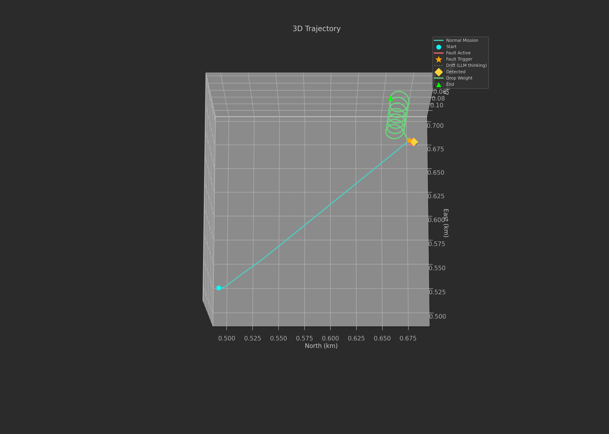
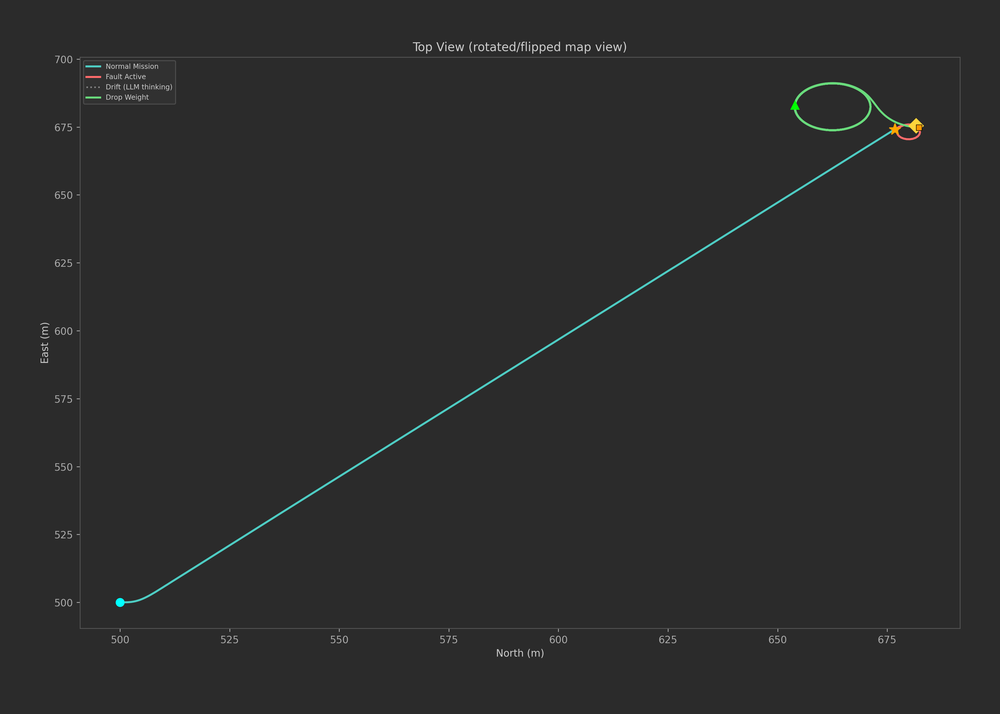
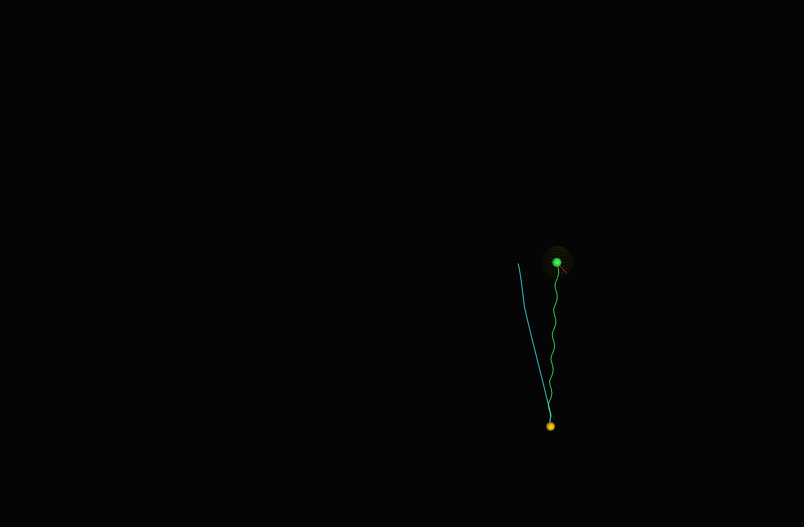
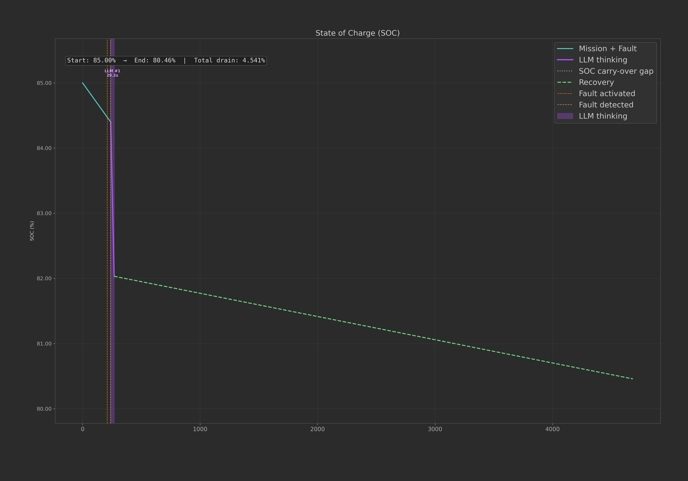
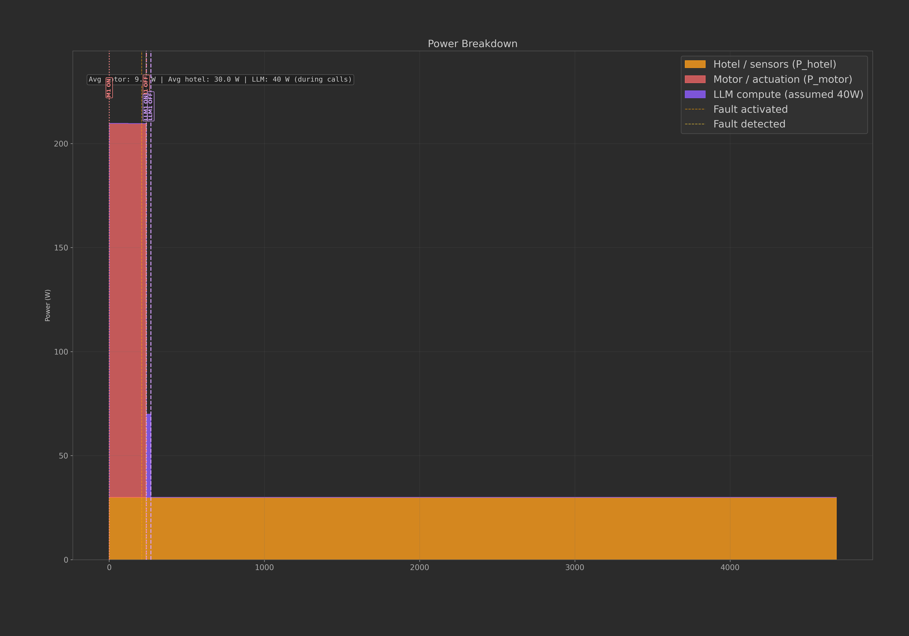
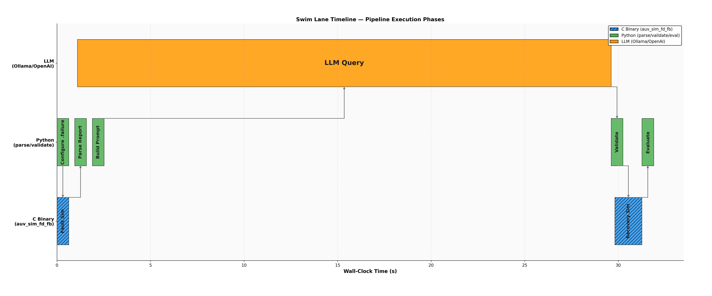
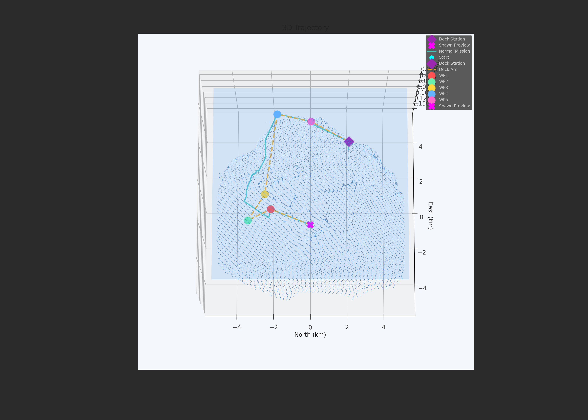
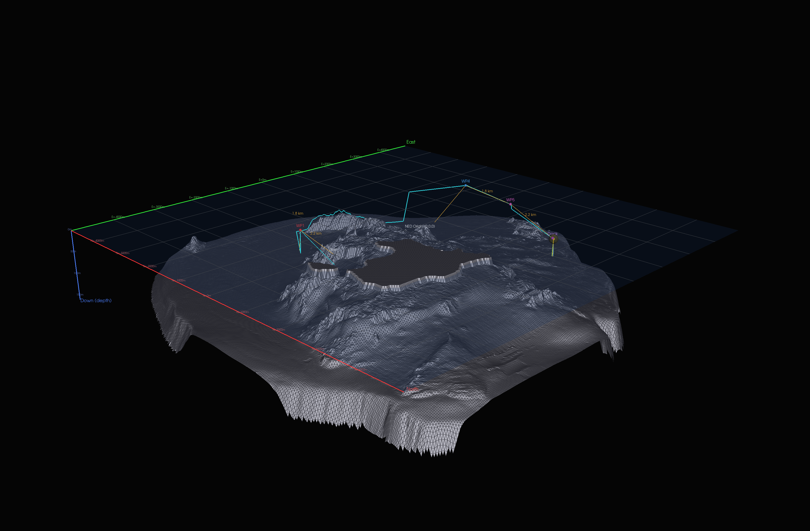
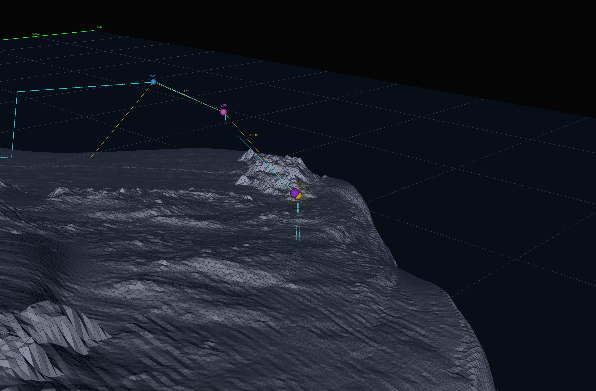
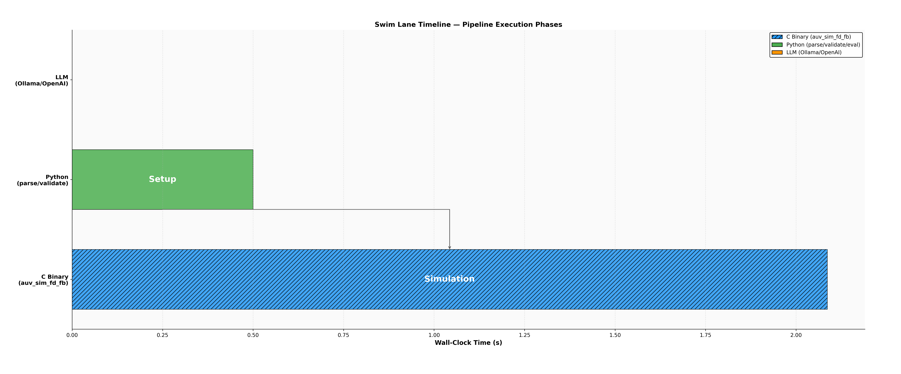

# SPAR-LLM-Data

**Simulation Platform for AUV Recovery via LLM — Experimental Dataset**

Exploration Robotics Laboratory, Johns Hopkins University
Institute for Assured Autonomy (JHU IAA), Baltimore, MD

**PI:** James G. Bellingham — Bloomberg Distinguished Professor, Executive Director JHU IAA, NAE Member
**Platform Developer:** Khalid Halba — Associate Research Scientist, JHU IAA

---

## Overview

This repository contains labeled experimental trials from **SPAR-LLM**, a fault recovery platform for autonomous underwater vehicles. Each trial represents a complete fault-injection → detection → LLM recovery → re-simulation → evaluation pipeline, producing telemetry, LLM prompts/responses, trajectory plots, battery forensics, and AI-generated strategy critiques.

The platform is built on the **MIT Sea Grant Odyssey II C binary** (1993–1998), a hardware-calibrated 50Hz 6-DOF physics simulator developed by PI Bellingham. Faults are injected at the actuator and sensor level, detected autonomously (zero false positives, ~10s latency), and recovery missions are generated by large language models via **NVIDIA NIM**.

**Publication:** K. Halba and J. G. Bellingham, "A Simulation Platform for AUV Fault Recovery: Exploring LLM-Based Planning Strategies," IEEE AUV 2026, Southampton, UK — **ACCEPTED** (oral presentation, Sep 1–3, 2026).

---

## How NVIDIA NIM Is Used

Every trial uses two NVIDIA NIM model calls via `integrate.api.nvidia.com`:

1. **Recovery mission generation:** `nvidia/nemotron-3-super-120b-a12b` receives a structured fault report (fault type, vehicle state, physics context, mission constraints) and generates a `.mission` file with the recovery behavior, strategy, and parameters.

2. **Post-run multimodal analysis:** `meta/llama-3.2-90b-vision-instruct` receives all telemetry tab data plus the battery plot PNG (SOC/voltage/current/power) and produces a written critique of the recovery strategy, flags near-misses, and suggests parameter improvements. Both text and image inputs are used in the same API call.

All trial metadata records `llm_provider: nvidia_nim` in `session_summary.json`. The dataset supports fine-tuning compact onboard edge models (`nvidia/nemotron-nano-9b-v2`) for deployment on **NVIDIA Jetson AGX Orin** within the AUV power envelope (60W, 275 TOPS, 64GB).

---

## Fault Recovery: Actuator Fault Example (Rudder Stuck)

The rudder jams at 0.35 rad (20 degrees) during a 200m deep survey. The vehicle begins spiraling uncontrollably. NVIDIA Nemotron 120B generates a drop-weight buoyancy ascent mission. The vehicle surfaces from 111.5m in 4,356 seconds.

### 3D Trajectory — Fault Phase (cyan) + Recovery Phase (green)



The cyan line shows the vehicle diving and beginning to spiral after the rudder jams at t=210s. The green line shows the recovery trajectory — a passive buoyancy ascent after dropping weights (no thrust, no hydrodynamic control).

### Top-Down View — Helicoidal Spiral Pattern



The top-down view reveals the characteristic helicoidal spiral caused by the stuck rudder. The vehicle traces a corkscrew pattern while ascending via buoyancy.

### VTK 3D Rendered View



### Battery — SOC Depletion Across Fault and Recovery Phases



SOC decreases during the fault phase (motor + hotel load), then the slope flattens during recovery (hotel load only — no motor power during drop-weight ascent).

### Battery — Power Breakdown (Motor vs Hotel)



Red = motor power (propulsion), Yellow = hotel (electronics). Motor power drops to zero during the drop-weight recovery phase — consistent with the LLM choosing a buoyancy-only strategy.

### Swim Lane Timeline — Behavior State Transitions



The swim lane shows the mission phases: normal survey → fault injection → error_trap detection → LLM query → recovery simulation → evaluation (PASS).

---

## Docking Scenario — USBL Homing Approach

Docking missions use a multi-waypoint arc approach followed by USBL acoustic homing to a dock station. The vehicle navigates 3 arc waypoints at constant depth (20m, 0.75 m/s), then descends to dock depth (30m) during the USBL homing phase.

### Docking Trajectory — Arc Waypoints + USBL Homing



The trajectory shows the vehicle traversing arc waypoints around terrain, then homing to the dock station via USBL acoustic measurements (range, azimuth, elevation). Bailout reached at 1.24m from dock.

### VTK 3D Rendered Views — Docking Approach



Perspective view of the full docking approach: arc waypoints at constant depth (20m), followed by USBL homing descent to dock depth (30m). Cyan trail = executed path. Dock station visible as target marker.



Close-up view of the final USBL homing approach. The vehicle converges on the dock station from the last arc waypoint, descending from 20m to 30m during the homing phase.


Top-down (N-E) view showing the arc waypoint geometry. The vehicle follows a curved path around terrain to approach the dock from a safe direction, avoiding bathymetry obstacles.

### Docking Swim Lane — Mission Phase Timeline



Surface transit → Arc WP1 → WP2 → WP3 → USBL Homing → Docking Capture. The USBL homing phase uses simulated acoustic measurements from `sim_usbl.c` (range-dependent Gaussian noise model).

---

## Dataset Scope

**Latest:** 4x rudder_stuck NIM API trials added March 28, 2026 — `nemotron-3-super-120b-a12b` via `integrate.api.nvidia.com`

700+ labeled trials generated across varying:
- **Fault types:** rudder stuck, depth sensor bias, thruster dead, elevator stuck, battery cell failure, USBL dropout, and 6 docking-specific faults: USBL bearing bias, compass offset, intermittent rudder dropout, accidental drop-weight release, bottom-collision buoyancy change, fin loss
- **Fault trigger times** (injected at different mission phases)
- **Fault parameter magnitudes** (rudder angle, sensor bias in meters, etc.)
- **Prompt tiers:** FULL (physics + strategy + params), GUIDED, CHALLENGE (minimal)
- **Recovery strategies:** drop-weight ascent, active spiral, setpoint hold, surface abort
- **Environmental conditions:** island present vs. absent, different bathymetry depths
- **LLM providers:** NVIDIA NIM (Nemotron 120B), Ollama (gpt-oss:20b, Nemotron Nano), OpenAI (GPT-5.2, o3)

---

## Repository Structure

```
experiments/
  rudder_stuck_nim_nemotron120b/
    trial_001/                          ← 20260328_003116 api_nvidia
    trial_002/                          ← 20260328_004938 api_nvidia
    trial_003/                          ← 20260328_012515 api_nvidia
    trial_004/                          ← 20260328_014221 api_nvidia
      experiment_config.json            ← fault params, LLM provider, model, prompt tier
      session_summary.json              ← outcome PASS/FAIL, tokens, llm_provider: nvidia_nim
      telemetry_et.csv                  ← 38-column 1Hz telemetry
      fault_trajectory.csv              ← fault phase markers
      fault_report.json                 ← JSONL: loaded, activated, detected, verified, final_state
      evaluation.txt                    ← evaluator decision and reasoning
      llm_prompt.txt / llm_response.txt ← full NIM prompt and raw response
      recovery_mission.mission          ← LLM-generated recovery mission file
      trajectory_plot.png               ← 3D/top/side trajectory
      swim_lane_timeline.png            ← behavior state timeline
      battery_plots_and_data/           ← SOC, voltage, current, power
      VTK views/                        ← 8 rendered 3D views
missions/
  docking_wp_arc_ramp_5_20260323_101836.mission  ← docking approach mission
figures/
  rudder_stuck_trajectory_3d.png        ← 3D fault + recovery trajectory
  rudder_stuck_trajectory_top.png       ← top-down helicoidal spiral view
  rudder_stuck_vtk_perspective.png      ← VTK 3D rendered view
  rudder_stuck_battery_soc.png          ← SOC depletion across phases
  rudder_stuck_battery_power.png        ← motor vs hotel power breakdown
  rudder_stuck_swim_lane.png            ← behavior state timeline
  docking_baseline_trajectory.png       ← arc waypoints + USBL homing
  docking_baseline_swim_lane.png        ← docking mission phase timeline
  docking_vtk_perspective.png           ← VTK 3D perspective of docking approach
  docking_vtk_close.png                 ← VTK close-up of USBL homing phase
  docking_vtk_top.png                   ← VTK top-down (N-E) arc geometry
```

---

## Extending to Docking Faults

The current NIM trials demonstrate **actuator fault recovery** on simple survey missions (rudder stuck → LLM generates recovery → vehicle surfaces). The next phase extends this to **docking fault scenarios**, where:

- Faults are injected during multi-waypoint arc traversal or USBL homing approach
- The LLM must decide: **reach the dock** (if feasible) or **abort to surface** (if not)
- Success criterion changes from "surfaced" to "USBL acquired + bailout range reached"
- 6 docking-specific faults are planned: USBL bearing bias, compass offset, intermittent rudder dropout, accidental drop-weight release, bottom-collision buoyancy change, fin loss

The evaluation infrastructure for docking is already operational — docking-aware prompts are the remaining work.

---

## Pipeline Architecture

```
Mission File (.mission)     →  C Binary (auv_sim_fd, 50Hz 6-DOF)
                                  ↓
                            Fault Injection (actuator jam / sensor bias)
                                  ↓
                            Error Trap (autonomous detection, ~10s)
                                  ↓
                            fault_report.json + ET telemetry (38 cols)
                                  ↓
                            NVIDIA NIM: Nemotron 120B (recovery .mission)
                                  ↓
                            Validate → Re-simulate → Evaluate
                                  ↓
                            NVIDIA NIM: Llama 90B Vision (AI critique)
                                  ↓
                            PASS / FAIL + exported trial data
```

---

## NVIDIA Platforms

| Platform | Role | Status |
|---|---|---|
| RTX 3090 (24GB) | All 700+ trials, TensorRT-LLM, Ollama | **Operational** |
| NVIDIA NIM API | Nemotron 120B generation + Llama 90B Vision analysis | **Operational** |
| Jetson AGX Orin (requested) | Onboard edge inference, nemotron-nano-9b-v2, 60W | **Planned** |
| RTX PRO 6000 x4 (requested) | 70B fine-tuning, quantization, ablation | **Planned** |
| A100 cloud (requested) | 100+ parallel sim, SFT/LoRA, closed-loop retraining | **Planned** |
| Isaac Sim / Omniverse (Phase 2) | High-fidelity digital twin, Tethys platform | **Planned** |

---

## Citation

K. Halba and J. G. Bellingham, "A Simulation Platform for AUV Fault Recovery: Exploring LLM-Based Planning Strategies," IEEE AUV 2026, Southampton, UK — **ACCEPTED**.

## License

MIT License. Generated in-house at JHU Institute for Assured Autonomy, Baltimore MD. No confidential or personal information. No NDA required.
